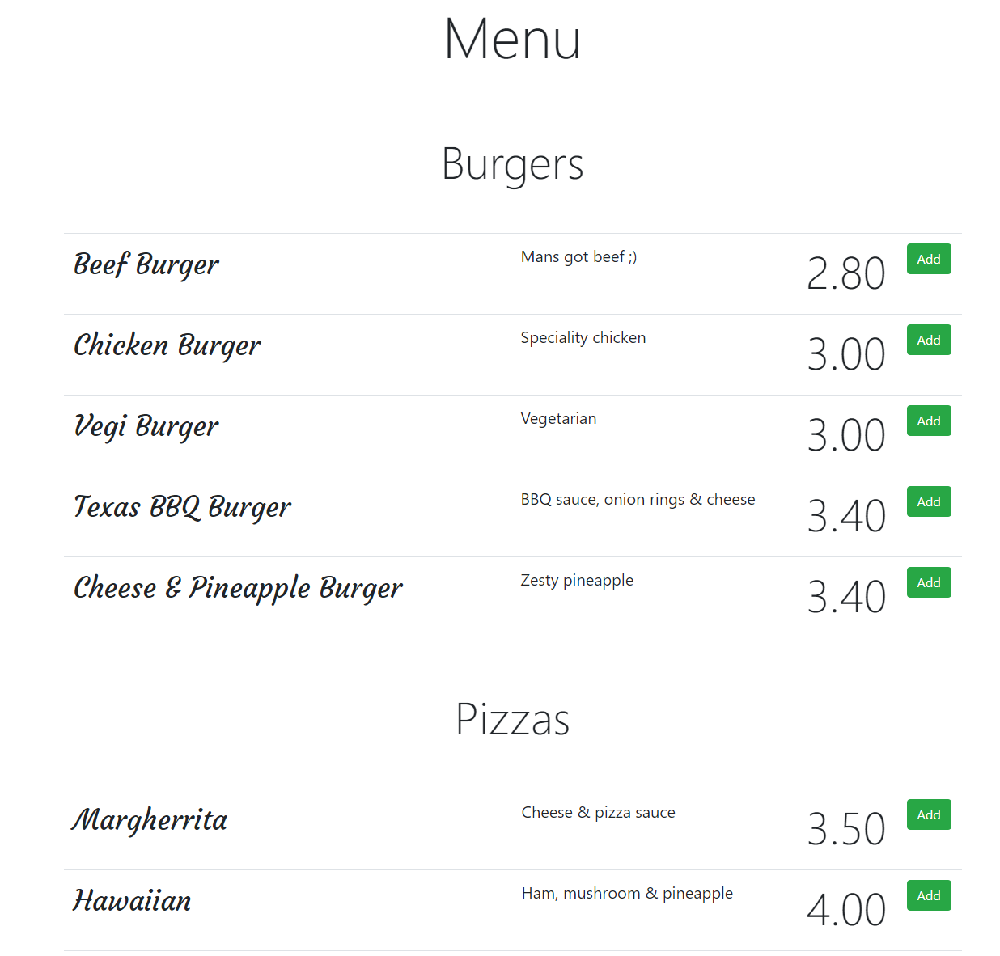
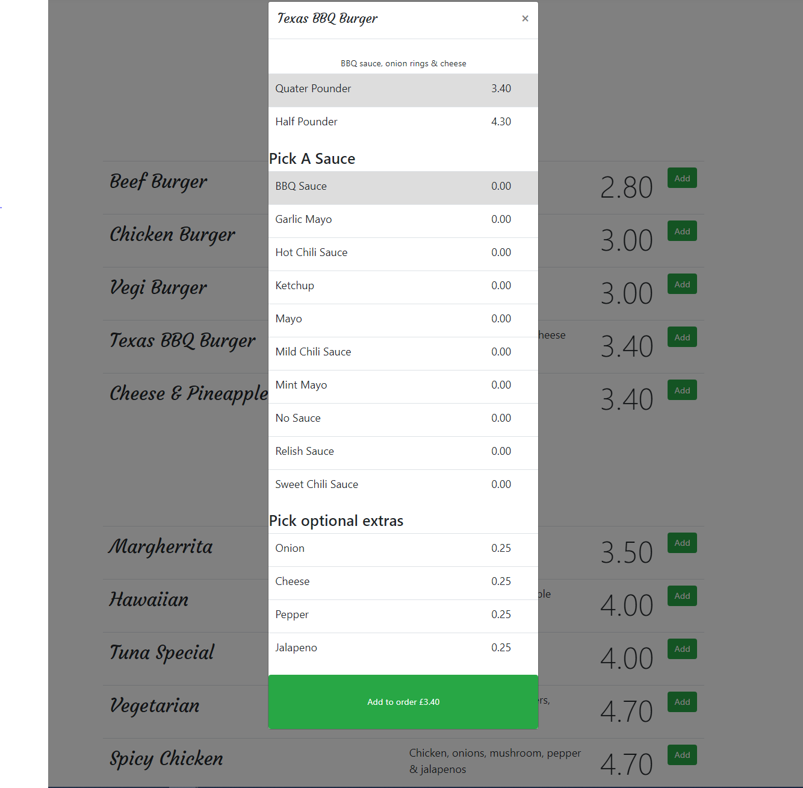
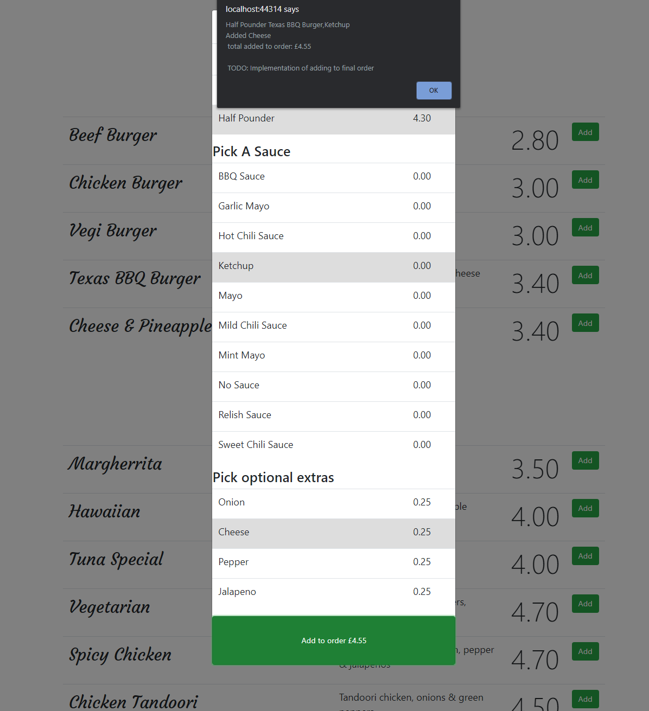

# FoodOrderMenu
Simple food menu ordering app, written in .Net Core that uses JavaScript and Jquery DataTables, populated via SQL 

TODO:

* Deploy to docker
* Work more on UI
* Add orders to main order list
* Create a resturant app that sees orders come in live
* Make use of inheritance and polymorphism when creating multiple food category tables

To allow this app to work on your PC, create a database called FoodMenu in SQL server management studio, and import the text files that have been provided in the Tables folder
(I know this is cumbersome, sorry. I will soon provide a query you can copy and paste)

Latly change your conneciton string in appsettings.json and run this query on the FoodMenu database:

alter database [FoodMenu] set enable_broker with rollback immediate;

Screenshots:

<h2>Main Menu</h2>

<h2>Menu Order Add</h2>

<h2>Menu Confirmed Order</h2> 

